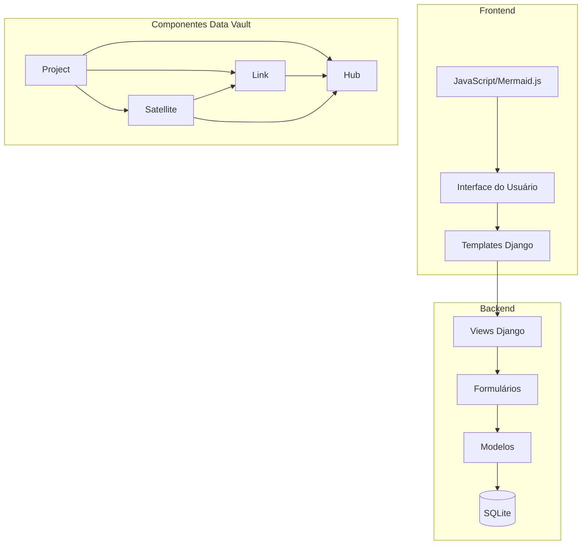
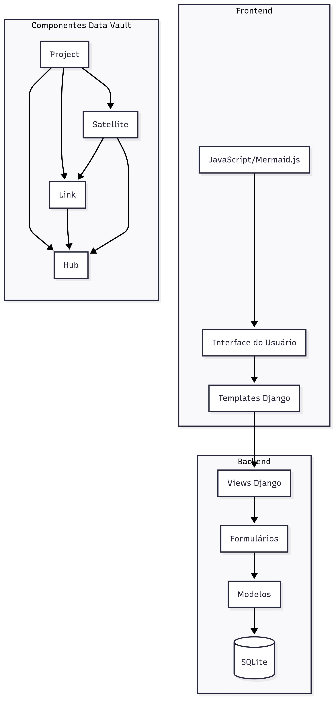
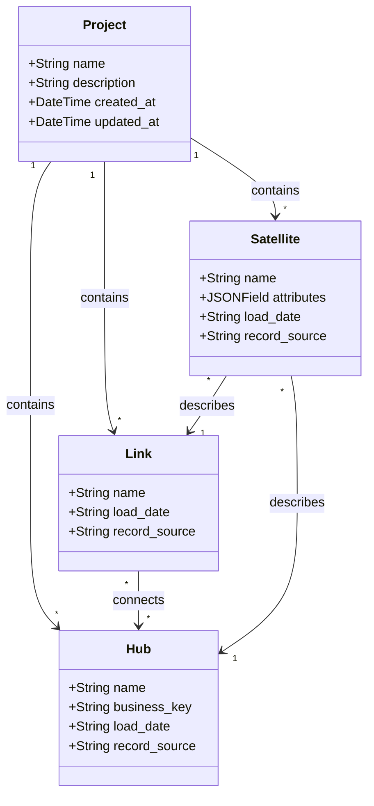
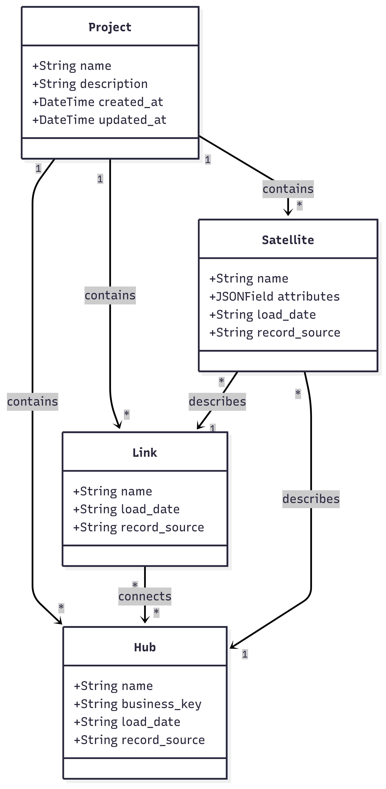
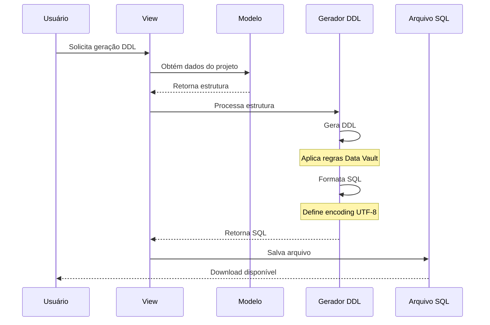
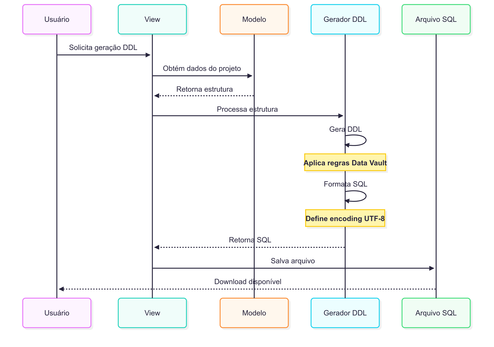

# Diagramas do Sistema

## Diagrama de Arquitetura

```mermaid
graph TD
    subgraph "Frontend"
        UI["Interface do Usuário"]
        Templates["Templates Django"]
        JS["JavaScript/Mermaid.js"]
    end

    subgraph "Backend"
        Views["Views Django"]
        Forms["Formulários"]
        Models["Modelos"]
        DB[(SQLite)]
    end

    subgraph "Componentes Data Vault"
        Project["Project"]
        Hub["Hub"]
        Link["Link"]
        Satellite["Satellite"]
    end

    UI --> Templates
    Templates --> Views
    JS --> UI
    Views --> Forms
    Forms --> Models
    Models --> DB
    
    Project --> Hub
    Project --> Link
    Project --> Satellite
    Link --> Hub
    Satellite --> Hub
    Satellite --> Link
```

## Diagrama de Classes

```mermaid
classDiagram
    Project "1" --> "*" Hub : contains
    Project "1" --> "*" Link : contains
    Project "1" --> "*" Satellite : contains
    Link "*" --> "*" Hub : connects
    Satellite "*" --> "1" Hub : describes
    Satellite "*" --> "1" Link : describes

    class Project{
        +String name
        +String description
        +DateTime created_at
        +DateTime updated_at
    }
    class Hub{
        +String name
        +String business_key
        +String load_date
        +String record_source
    }
    class Link{
        +String name
        +String load_date
        +String record_source
    }
    class Satellite{
        +String name
        +JSONField attributes
        +String load_date
        +String record_source
    }
```

## Diagrama de Sequência - Geração de DDL

```mermaid
sequenceDiagram
    participant U as Usuário
    participant V as View
    participant M as Modelo
    participant G as Gerador DDL
    participant F as Arquivo SQL

    U->>V: Solicita geração DDL
    V->>M: Obtém dados do projeto
    M-->>V: Retorna estrutura
    V->>G: Processa estrutura
    G->>G: Gera DDL
    Note over G: Aplica regras Data Vault
    G->>G: Formata SQL
    Note over G: Define encoding UTF-8
    G-->>V: Retorna SQL
    V->>F: Salva arquivo
    F-->>U: Download disponível
``` 

